  <!-- Premium Hero Banner (auto-switches with GitHub theme) -->
  <picture>
    <source media="(prefers-color-scheme: dark)" srcset="dark.svg"/>
    <source media="(prefers-color-scheme: light)" srcset="light.svg"/>
    
  </picture>

 

  
  
  
  

---

## About Me

I build at the intersection of **AI/ML**, **Embedded Systems**, and **Full-Stack Development**. From computer vision on Raspberry Pi to Linux kernel drivers, I enjoy solving real-world problems with code.

- Currently working on AI-powered embedded systems and open-source Linux tools
- Built [Predator Helios Linux Control Center](https://github.com/ananthakrishnan754/Predator-Helios-16-Linux-Control-Center) — bringing RGB & fan control to Linux
- Creating [TimeTraveller](https://github.com/ananthakrishnan754/time-traveller) — AI age-progression from a single photo
- Building agentic AI systems and voice agents

---

## Tech Stack

### Languages

### AI / ML

### Embedded & IoT

### Hardware & CAD

### Tools & Platforms

---

## Featured Projects

### [Predator Helios 16 Linux Control Center](https://github.com/ananthakrishnan754/Predator-Helios-16-Linux-Control-Center)
RGB keyboard control, fan mode switching, and custom fan curves for Acer Predator Helios 16 on Linux.

`Linux` `Kernel` `RGB` `Hardware`

### [AI Waste Sorter](https://github.com/ananthakrishnan754/ai-waste-sorter-)
Smart waste sorting with Raspberry Pi, computer vision, and servo-controlled routing.

`Computer Vision` `Raspberry Pi` `Edge AI`

### [TimeTraveller](https://github.com/ananthakrishnan754/time-traveller)
Offline AI age-progression from a single photo using computer vision.

`AI` `Computer Vision` `Flask`

### [WhatsApp Summarizer](https://github.com/ananthakrishnan754/WhatsApp-Summarizer)
Android app that reads WhatsApp notifications, summarizes messages, and transcribes voice notes using Gemini AI.

`Android` `Gemini AI` `NLP`

### [Face Recognition for Alzheimer's Patients](https://github.com/ananthakrishnan754/Deep-learning-based-real-time-face-recognison-system-for-alzheimer-s-patients)
Real-time face recognition system for Alzheimer's patient care.

`Deep Learning` `Computer Vision` `Healthcare`

---

## Recent Activity

<!--START_SECTION:activity-->
<!--END_SECTION:activity-->

---

  

  <i>Let's connect and build something amazing together!</i>
   
  <a href="https://ananthakrishnans.me">ananthakrishnans.me</a>

